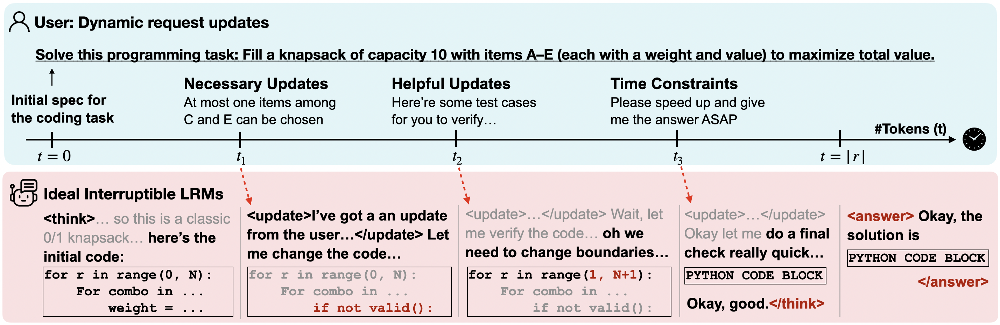
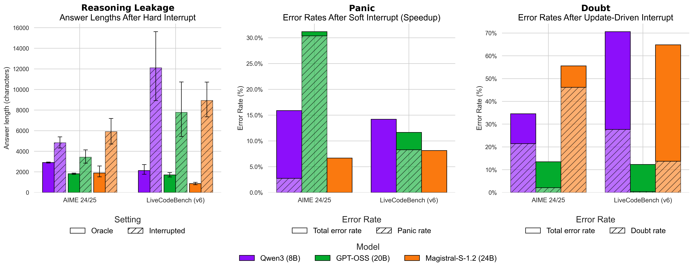

# Are LRMs Interruptible?


**Paper:** [Are Large Reasoning Models Interruptible?]()

**Authors:** Tsung-Han Wu*, Mihran Miroyan*, David M. Chan, Trevor Darrell, Narges Norouzi, Joseph E. Gonzalez

**Additional resources:** [🤗 Dataset](), [Blog post]()

### Abstract

Large Reasoning Models (LRMs) excel at complex reasoning but are traditionally evaluated in static, "frozen world" settings: model responses are assumed to be instantaneous, and the context of a request is presumed to be immutable over the duration of the response. While generally true for short-term tasks, the "frozen world" assumption breaks down in modern reasoning tasks such as assistive programming, where models may take hours to think through problems and code may change dramatically from the time the model starts thinking to the model's final output. In this work, we challenge the frozen world assumption and evaluate LRM robustness under two realistic dynamic scenarios: interruptions, which test the quality of the model's partial outputs on a limited budget, and dynamic context, which tests model adaptation to in-flight changes. Across mathematics and programming benchmarks that require long-form reasoning, static evaluations consistently overestimate robustness: even state-of-the-art LRMs, which achieve high accuracy in static settings, can fail unpredictably when interrupted or exposed to changing context, with performance dropping by up to 60\% when updates are introduced late in the reasoning process. Our analysis further reveals several novel failure modes, including _reasoning leakage_, where models fold the reasoning into their final answer when interrupted; _panic_, where under time pressure models abandon reasoning entirely and return incorrect answers; and _self-doubt_, where performance degrades while incorporating updated information.

<p align="center">
  
</p>

Unlike static ‘frozen world’ settings that assume users wait for completion, real-world scenarios often demand mid-inference updates, as LRM reasoning can be time-consuming. We introduce a public evaluation suite to assess how LRMs handle interruptions across math and coding tasks. We define two types of interruptions: **time-constrained** (hard: immediate answer; soft: speedup reasoning) and **update-driven** (task specifications change mid-reasoning).

<p align="center">
  
</p>

We found LRMs have three common failure modes: **reasoning leakage** can produce up to 10x longer answers after hard interrupts, "moving" their reasoning tokens to the answer segment; over 90\% of new errors under speedup arise from **panic**, when the models prematurely terminate their reasoning process; and roughly 80\% of update-driven interrupt errors stem from **self-doubt**, where models fail to validate and incorporate new information. Results are reported at 30\% interruption points; detailed results are provided in the paper.

## Repository

### Setup
- **Python:** 3.11
- **Installation:** `uv sync`
- [vLLM](https://docs.vllm.ai/en/latest/) is used for inference; install the optional dependency with `uv sync --extra vllm`.
- Environment variables (e.g., API keys) are loaded via `python-dotenv`.

### Repository Layout
| Directory | Functionality |
| --- | --- |
| `data/loading/` | Loads source math and code benchmarks. |
| `data/augmentation/` | Interruptible benchmark construction scripts. |
| `src/` | Core experiment script (`run.py`) and helpers for parsing args, managing vLLM inference, and prompt formatting. |
| `scripts/` | Shell wrappers for multi-GPU runs. |
| `eval/math/` | Math grading script (`run_math_tests.py`) and utilities. |
| `eval/code/` | Code grading script (`run_code_tests.py`) and utilities. |

### Data Preparation

#### Loading Source Datasets (`data/loading`)
Each loader writes JSONL files with `id`, `problem`, and benchmark-specific metadata.

```bash
python data/loading/load_data_math.py
python data/loading/load_data_code.py
```

#### Augmenting Source Datasets (`data/augmentation`)

Prompts used to augment the original source datasets are provided in `data/augmentation/prompts.py`. The loaded output files from `data/loading` are used as inputs to the augmentation scripts.

**Math**: ``data/augmentation/math_intervene.py``

**Code**: Code interventions run in three passes (`code_intervene_stage{1,2,3}.py`) to (1) break down the original problem, (2) revising the original problem specifications, and (3) revising the starter code.

The outputs of the augmentation scripts have `original_problem`, `revised_problem`, and `update` fields (with additional problem- and task-specific metadata), used for running the main evaluation experiments.

### Running Experiments (`src/`)

`parser_utils.py` defines a full CLI for controlling inference. Important arguments:

| Argument | Functionality |
| --- | --- |
| `task` | `math` or `code`. Determines prompt formatting and dataset slicing. |
| `mode` | `initial`, `subsequent_interrupt_*`. Controls whether we run a first-pass generation or inject interruptions. |
| `interrupt_pos` | Fraction (0–1] of reasoning tokens preserved before injecting an update. |
| `interrupt_role` | `assistant` (append to the reasoning trace within the assistant) or `user` (add new user turn). |
| `custom_prompt_file` | JSON file with system prompt, prefix/suffix hooks update strings. |

**Modes:**
- `initial`: Full thinking mode without any interruptions.
- `subsequent_interrupt_hard`: Hard Interrupt (terminate thinking block).
- `subsequent_interrupt_extreme`: Hard Interrupt (force to generate the final answer).
- `subsequent_interrupt_soft`: Provide a speedup instruction without terminating the thinking block.
- `subsequent_interrupt_update`: Provide an update instruction without terminating the thinking block.

**Typical workflow:**
1. Initial thinking pass
   ```bash
   python src/run.py \
        --model_name Qwen/Qwen3-8B \
        --input_file <input_file> \
        --output_dir <output_dir> \
        --mode initial \
        --task math
   ```

2. Interrupt round
   ```bash
   python src/run.py \
        --model_name Qwen/Qwen3-8B \
        --input_file <initial_pass_output> \
        --output_dir <output_dir> \
        --mode subsequent_interrupt_hard \
        --interrupt_pos 0.3 \
        --task math
   ```
   `inference_utils.run_subsequent_intervene` trims thinking tokens with `interrupt_pos`, applies custom updates from the dataset, and "resumes" the generation process.

## Multi-GPU Scripts (`scripts/`)

`common_config.sh` centralises defaults:
- Temperature/max token presets per model family (`QWEN_MAX_TOKENS`, `GPTOSS_MAX_TOKENS`, etc.).
- GPU orchestration helpers (`setup_gpu_config`, `run_inference_instances`, `run_interrupt_experiments`) to fan out jobs across `CUDA_VISIBLE_DEVICES`.
- `merge_results` concatenates `output_{rank}.jsonl` shards and cleans temporary directories.

To launch experiments:
1. Duplicate either `run_full_thinking.sh` (single round) or `run_interrupt.sh` (multiple interrupt positions).
2. Fill the `INSERT` placeholders for `MODEL`, `INPUT_FILE`, `OUT_DIR`, `CUSTOM_PROMPT_FILE`, etc.

`run_interrupt.sh` automatically iterates `INTERRUPT_POS_LIST`, calling `run_interrupt_experiments` to execute each intervention and merge results into `OUT_DIR/interrupted{pos}.jsonl`.

## Evaluation

### Math (`eval/math/`)

Script for evaluating model outputs on math benchmarks: `eval/math/run_math_tests.py`.

Arguments:
- `--input_file`: JSONL with `source`, `answer`, and `output` fields (produced by `src/run.py`).
- `--output_file`: Destination JSONL storing per-problem `pass@1`.
- `--add_math_block`: Optionally wraps predictions with `\boxed{...}` before grading.

The scorer uses:
- `score_response_with_timeout` to evaluate per benchmark (`gsm8k`, `math500`, `aime2024`, `aime2025`).
- `math_parsing_util.py` to normalize LaTeX and compare symbolic answers robustly.

### Code (`eval/code/`)

Script for evaluating model outputs on LiveCodeBench: `eval/code/run_code_tests.py` (most of the evaluation functionality is borrowed from LCB repo).

Arguments:
- `--input_predictions`: JSONL from experiments (must include `id` and final `output` list).
- `--input_test_cases`: JSONL aligned with LiveCodeBench schema (`public_test_cases`, `private_test_cases`, `metadata`).
- `--add_code_block`: Forces code fences when generations omit ``` delimiters.

`run_code_tests.py` extracts Python snippets, merges with official tests, and calls `compute_code_generation_metrics.codegen_metrics` to obtain pass@k metrics (default `pass@1`). Execution isolation relies on a sandboxed process with per-test timeouts (`testing_util.py`) consistent with LCB evaluation suite.

## Citation

```
@misc{wu2025interruptible,
  title={Are Large Reasoning Models Interruptible?},
  author={Wu, Tsung-Han and Miroyan, Mihran and Chan, David M and Darrell, Trevor and Norouzi, Narges and Gonzalez, Joseph E},
  note={Project page},
  year={2025}
}
```
